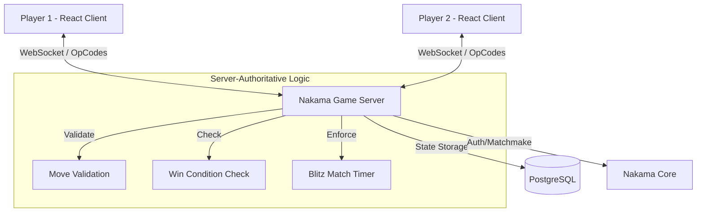

# ✕ ○ Tic-Tac-Toe: Server-Authoritative Multiplayer

A professional-grade, real-time multiplayer Tic-Tac-Toe game designed with a **Server-Authoritative** architecture. Built as a technical showcase for distributed game state synchronization and competitive fair play.

### 🔗 Links
- [**Live Demo**](https://tic-tac-toe-nine-rho-59.vercel.app/)
- [**GitHub Repository**](https://github.com/abhi-wd/ticTacToe.git)

---

### 🚀 Key Features

- **100% Server-Authoritative**: All game logic, win conditions, and move validations are handled by the Nakama backend, preventing client-side cheating.
- **Real-Time Matchmaking**: Automated queuing for "Classic" and "Blitz" modes.
- **Global Leaderboard**: Persistent player statistics tracking wins, losses, and streaks.
- **Blitz Mode (Timer-Based)**: Fast-paced 30-second match loops with server-enforced timeouts.
- **Private Room Codes**: Play with friends using unique 5-digit joining codes.
- **Interactive Emotes**: Live in-game emotes synced across WebSockets for social interaction.

### 🏗️ Architecture

The game follows a **Server-Authoritative Match** pattern to ensure game integrity and prevent client-side manipulation.

- **Client-Side**: A lightweight "dumb view" using React and Zustand. It receives state updates via WebSockets and sends player intents (moves, emotes) to the server.
- **Server-Side**: The Nakama server (TypeScript runtime) holds the "Gold Truth". It processes all match loops, manages timers, and broadcasts state changes to all connected peers.
- **Matchmaking**: Utilizes Nakama's native matchmaking to pair players into private or public rooms based on selected game modes.

### 🛠️ Technology Stack

- **Frontend**: React.js, Vite, TailwindCSS, Zustand
- **Backend**: Nakama Game Server (TypeScript)
- **Database**: PostgreSQL
- **Infrastructure**: Docker, Vercel (Frontend), DigitalOcean (Backend)

---

### 📖 Project Overview

This project demonstrates a robust implementation of multiplayer gaming patterns. By utilizing **Nakama's Matchmaker** and **Authoritative Match API**, the game ensures a consistent state for all players regardless of latency or device performance. The frontend is a highly reactive "view" that reflects the server's authoritative state, while the backend manages the complex orchestration of private rooms, emote multiplexing, and competitive scoring.

### 🎨 Design & UX

The game features a premium, responsive design built with **TailwindCSS**, optimized for both mobile and desktop. Smooth transitions, interactive hover states, and dynamic emote pop-ups provide an engaging user experience that goes beyond a standard Tic-Tac-Toe implementation.
